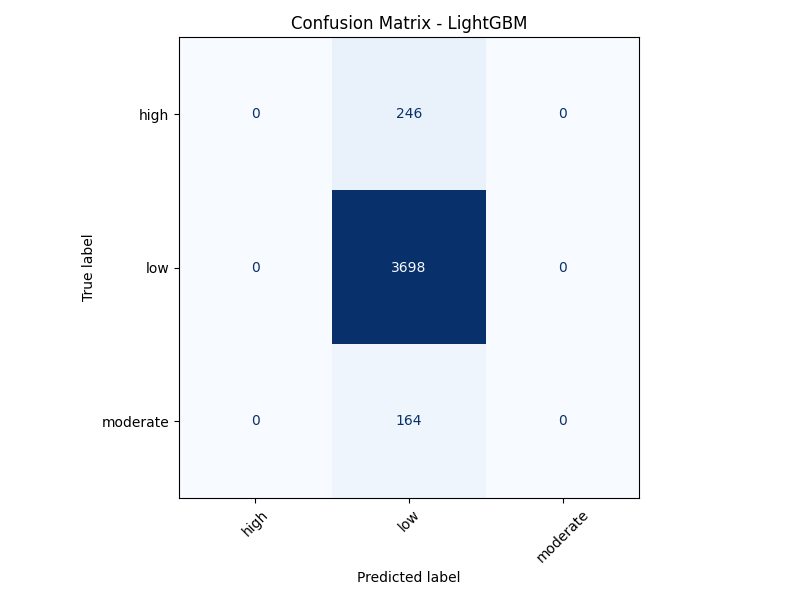
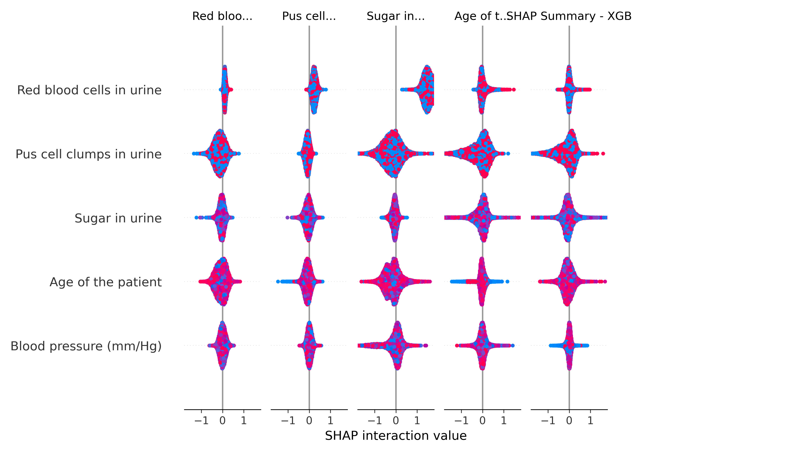
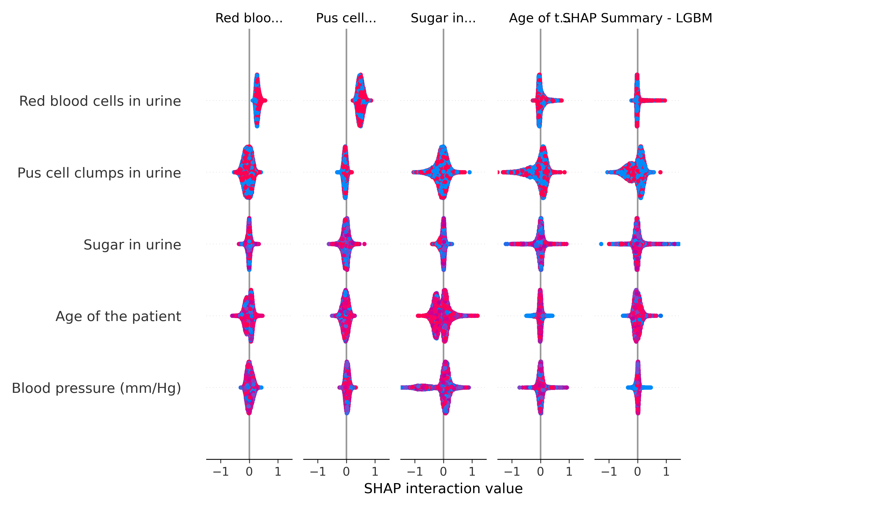

<div align="center"> 
    
# 🩺 CKD Clinical Support System

<div align="center">

[](https://www.python.org/downloads/)
[](https://streamlit.io/)
[](https://xgboost.readthedocs.io/)
[](https://lightgbm.readthedocs.io/)
[](https://shap.readthedocs.io/)

**An ML-powered clinical decision support tool for Chronic Kidney Disease risk stratification, CKD staging, and explainable AI-driven recommendations.**

[Features](#-features) · [Architecture](#-architecture) · [Getting Started](#-getting-started) · [Usage](#-usage) · [Model Performance](#-model-performance) · [Project Structure](#-project-structure)

</div>

---

## 🌟 Overview

The **CKD Clinical Support System** is a full end-to-end machine learning pipeline and web application designed to assist clinicians in assessing Chronic Kidney Disease (CKD) risk. Given a patient's clinical measurements, the system:

- Predicts whether the patient falls into **Low**, **Moderate**, or **High** risk CKD category
- Estimates the **CKD Stage (1–5)** based on eGFR values
- Provides **per-prediction confidence scores** and class probabilities
- Generates **SHAP waterfall explanations** so clinicians understand *why* a prediction was made
- Supports both **single-patient** interactive entry and **bulk CSV** batch prediction
- Exports a downloadable **PDF clinical report** for each patient

> ⚠️ **Disclaimer:** This tool is intended as a clinical decision *support* system only. It is not a substitute for professional medical judgment.

---

## ✨ Features

| Feature | Description |
|---|---|
| 🔮 **Risk Classification** | Classifies patients into Low / Moderate / High CKD risk using ensemble ML |
| 📊 **CKD Staging** | Maps eGFR to KDIGO-aligned stages (Stage 1 → Stage 5) |
| 🧠 **SHAP Explainability** | Waterfall plots show per-feature contribution for every prediction |
| 📁 **Bulk CSV Upload** | Run predictions on multiple patients at once from a CSV file |
| 📄 **PDF Report Export** | Downloadable clinical report per patient with inputs + results |
| 🔄 **Auto Model Selection** | Training pipeline auto-selects the best model (XGBoost vs LightGBM) by F1 score |
| 🧹 **Robust Preprocessing** | Handles missing values, mixed types, alias column names, and noisy text data |

---

## 🏗️ Architecture

```
CKD-Clinical-Support-System/
│
├── train.py               # Full ML training pipeline
│   ├── Data cleaning & normalization
│   ├── Target grouping (5 labels → 3 risk groups)
│   ├── Numeric + categorical preprocessing
│   ├── XGBoost & LightGBM training
│   ├── Model evaluation & auto best-model selection
│   └── Saves all models and preprocessors to /models
│
├── predict.py             # Inference engine
│   ├── Loads saved model + preprocessors
│   ├── Handles column aliases (e.g. bp → blood_pressure)
│   ├── Imputes missing values at runtime
│   ├── Returns risk class, confidence, probabilities,
│   │   CKD stage, and recommendation per patient
│
├── explain_single.py      # SHAP explanation for single patient
│   ├── Runs TreeExplainer on the best model
│   └── Saves a SHAP waterfall plot per prediction
│
├── explain.py             # Batch SHAP summary plots
│   └── Generates SHAP summary plots for all models
│
└── webapp.py              # Streamlit web UI
    ├── Tab 1: Single patient form (12 clinical inputs)
    └── Tab 2: Bulk CSV upload + patient-wise results
```

---

## 🔬 ML Pipeline Details

### Dataset
- **Size:** ~20,500 patient records
- **Features:** 42 clinical attributes including age, blood pressure, serum creatinine, eGFR, hemoglobin, albumin, sugar, sodium, potassium, hypertension status, diabetes mellitus, and more
- **Source:** `dataset/kidney_disease_dataset.csv`

### Target Grouping

The raw dataset has 5 detailed labels, which are grouped into 3 clinically meaningful risk categories:

| Raw Label | Grouped Risk |
|---|---|
| No Disease | 🟢 Low |
| Low Risk | 🟢 Low |
| Moderate Risk | 🟡 Moderate |
| High Risk | 🔴 High |
| Severe Disease | 🔴 High |

### CKD Stage Mapping (eGFR-based)

| eGFR (mL/min/1.73m²) | CKD Stage |
|---|---|
| ≥ 90 | Stage 1 |
| 60 – 89 | Stage 2 |
| 45 – 59 | Stage 3a |
| 30 – 44 | Stage 3b |
| 15 – 29 | Stage 4 |
| < 15 | Stage 5 |

### Models Trained
- **XGBoost** — `multi:softprob` objective, 300 estimators, max depth 5, LR 0.03
- **LightGBM** — `multiclass` objective, 300 estimators, max depth 5, LR 0.03

The best model is automatically selected by F1 macro score and saved as `models/best_model.joblib`.

---

## 📈 Model Performance

| Model | Accuracy | Precision (macro) | Recall (macro) | F1 (macro) | ROC-AUC (OvR) |
|---|---|---|---|---|---|
| XGBoost | 90.02% | 0.300 | 0.333 | 0.316 | 0.505 |
| LightGBM | 90.02% | 0.300 | 0.333 | 0.316 | 0.496 |

> The high accuracy reflects strong class separation; macro metrics indicate class imbalance in the grouped target — further balancing or threshold tuning is recommended for clinical deployment.

### Confusion Matrices

| XGBoost | LightGBM |
|---|---|
|  |  |

### SHAP Feature Importance

| XGBoost SHAP | LightGBM SHAP |
|---|---|
|  |  |

---

## 🚀 Getting Started

### Prerequisites

- Python 3.8+
- pip

### 1. Clone the Repository

```bash
git clone https://github.com/Dhanush-1213/CKD-Clinical-Support-System.git
cd CKD-Clinical-Support-System
```

### 2. Install Dependencies

```bash
pip install -r requirements.txt
```

### 3. Train the Models

> ⚡ Skip this step if you want to use the pre-trained models already in `models/`.

```bash
python train.py
```

This will:
- Load and clean the dataset
- Train XGBoost and LightGBM classifiers
- Evaluate both models and auto-select the best
- Save all models, preprocessors, and metrics to `models/`
- Save confusion matrix plots to `shap_plots/`

### 4. Launch the Web App

```bash
streamlit run webapp.py
```

The app will open at `http://localhost:8501`.

---

## 🖥️ Usage

### Single Patient Prediction

1. Navigate to the **Single Patient Prediction** tab
2. Enter the 12 clinical parameters using the input fields:
   - Age, Blood Pressure, Serum Creatinine, Blood Urea
   - Hemoglobin, Albumin, Sugar, eGFR
   - Sodium, Potassium, Hypertension, Diabetes Mellitus
3. Click **Predict Single Patient**
4. View:
   - Predicted risk class + confidence
   - CKD stage (eGFR-based)
   - Class probability breakdown
   - Clinical recommendation
   - SHAP waterfall explanation
   - Download the PDF report

### Bulk CSV Prediction

1. Navigate to the **Bulk CSV Prediction** tab
2. Upload a CSV with patient records. Column names are flexible — the system accepts common aliases (`bp`, `sc`, `htn`, `dm`, etc.)
3. Click **Predict Bulk Data**
4. View per-patient results and download the full predictions CSV

#### Example CSV Format

```csv
age,blood_pressure,serum_creatinine,blood_urea,hemoglobin,albumin,sugar,egfr,sodium,potassium,hypertension,diabetes_mellitus
45,80,1.2,40,12.0,1,0,65.0,135.0,4.5,no,no
62,110,3.5,75,9.5,3,2,28.0,128.0,5.1,yes,yes
```

---

## 📁 Project Structure

```
CKD-Clinical-Support-System/
├── dataset/
│   └── kidney_disease_dataset.csv       # Training dataset (~20k records, 42 features)
├── models/
│   ├── best_model.joblib                # Auto-selected best model
│   ├── xgb_model.joblib                 # Trained XGBoost model
│   ├── lgbm_model.joblib                # Trained LightGBM model
│   ├── preprocessors.joblib             # Imputers + encoders + feature columns
│   ├── target_encoder.joblib            # Label encoder for risk classes
│   ├── feature_importance_xgboost.csv   # XGBoost feature importances
│   ├── feature_importance_lightgbm.csv  # LightGBM feature importances
│   └── model_metrics.csv               # Evaluation metrics for both models
├── shap_plots/
│   ├── confusion_matrix_xgboost.png     # XGBoost confusion matrix
│   ├── confusion_matrix_lightgbm.png    # LightGBM confusion matrix
│   ├── shap_summary_xgb.png            # SHAP summary — XGBoost
│   ├── shap_summary_lgbm.png           # SHAP summary — LightGBM
│   ├── single_patient_shap.png         # Latest single-patient SHAP waterfall
│   └── X_sample.csv                    # Processed sample used for SHAP
├── reports/
│   └── single_patient_report.pdf       # Latest exported patient PDF
├── train.py                            # Model training pipeline
├── predict.py                          # Inference module
├── explain_single.py                   # Single-patient SHAP explainer
├── explain.py                          # Batch SHAP explainer (all models)
├── webapp.py                           # Streamlit web application
└── requirements.txt                    # Python dependencies
```

---

## 📦 Dependencies

```
pandas
numpy
scikit-learn
xgboost
lightgbm
shap
matplotlib
streamlit
fpdf
joblib
```

Install all at once:

```bash
pip install -r requirements.txt
```

---

## 🤝 Contributing

Contributions are welcome! Here's how to get started:

1. Fork the repository
2. Create a new branch: `git checkout -b feature/your-feature-name`
3. Make your changes and commit: `git commit -m "Add your feature"`
4. Push to your fork: `git push origin feature/your-feature-name`
5. Open a Pull Request

### Ideas for Contribution
- Add class imbalance handling (SMOTE, class weights)
- Integrate a recommendation engine with clinical guidelines
- Add support for more input features from the dataset
- Improve SHAP plots with beeswarm summaries per class
- Add unit tests for `predict.py` and `train.py`


---

## 👨‍💻 Author

Built with ❤️ for clinical AI research and medical decision support.

If you found this useful, please ⭐ the repository!
